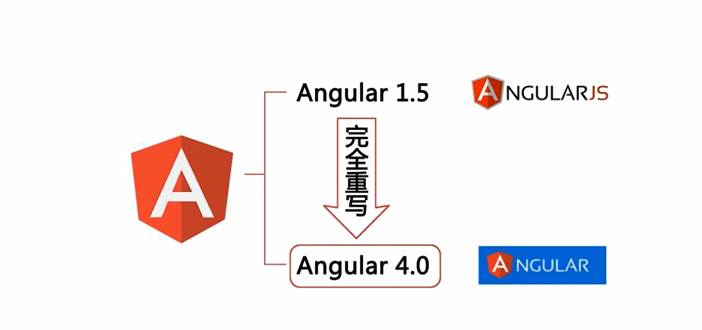
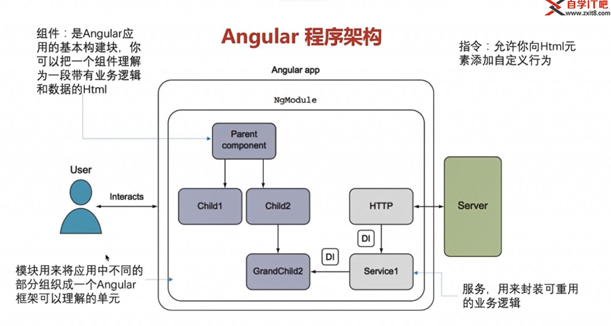
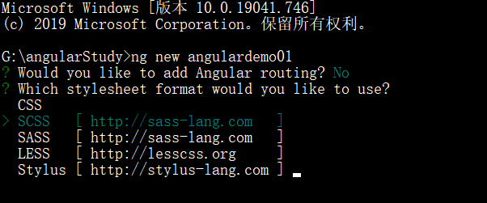
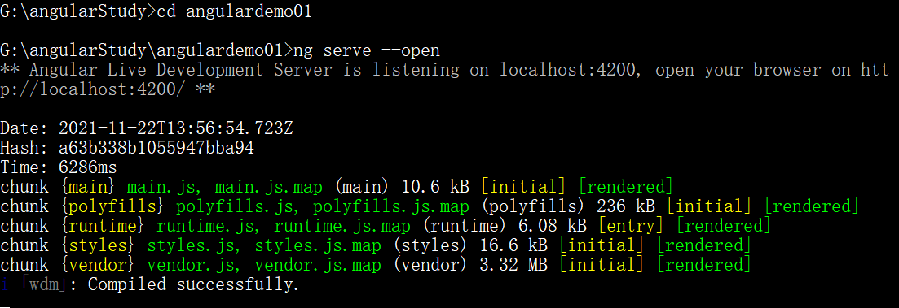
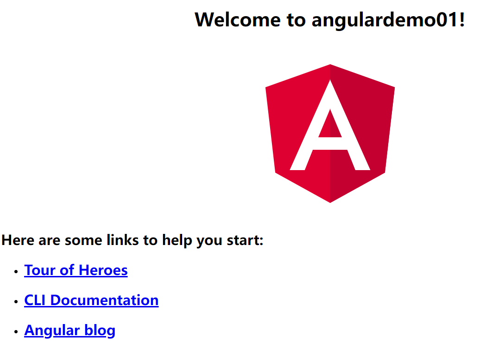
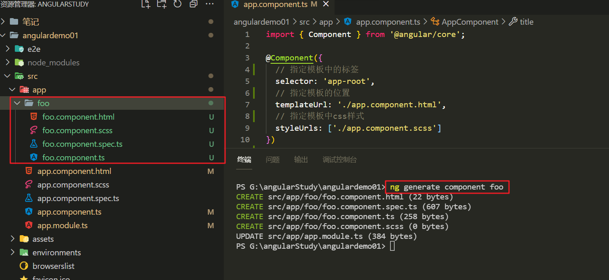
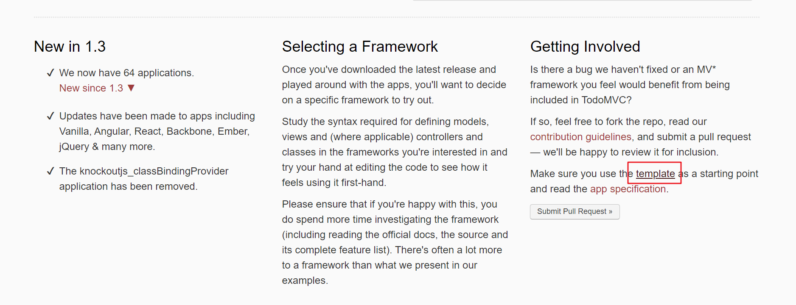
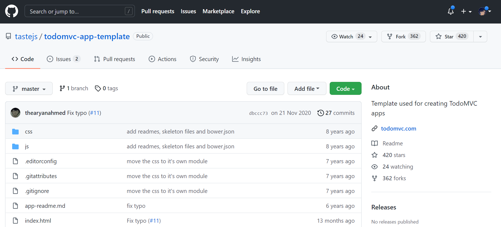
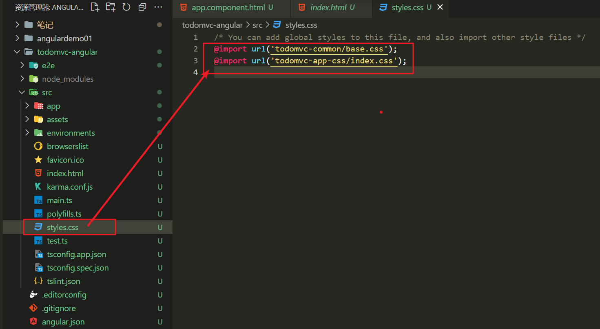

# 一. Angular介绍

**版本**

`angularJS`和`angular`是两个完全不同的东西

**三个框架对比**

**程序架构**

⏹组价,服务,指令是用来完成功能的

⏹模块是用来打包和分发这些功能的

# 二. 环境搭建

⏹安装脚手架工具

`npm install -g @angular/cli@7.0.6`

通过`ng v` 命令查看是否安装成功

⏹通过脚手架项目创建

`ng new 项目名称`

⏹运行项目

`ng serve --open`

---

---

# 三. 创建组件

⏹通过命令行生成模块

`ng generate component 组件名称`

# 四. todomvc案例

- 案例网站

  https://todomvc.com/

- 找到模板文件地址https://github.com/tastejs/todomvc-app-template

  

  

- 下载案例模板,并将模板复制到自己的项目中

  由于模板中的css是已经被打包到模块中,因此需要通过npm手动安装一下

  `npm install todomvc-common todomvc-app-css`

- 在项目中手动引入模块中的CSS样式(全局引入)

  